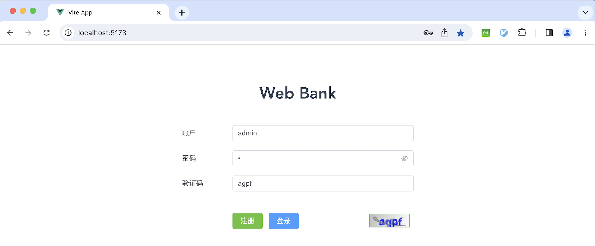
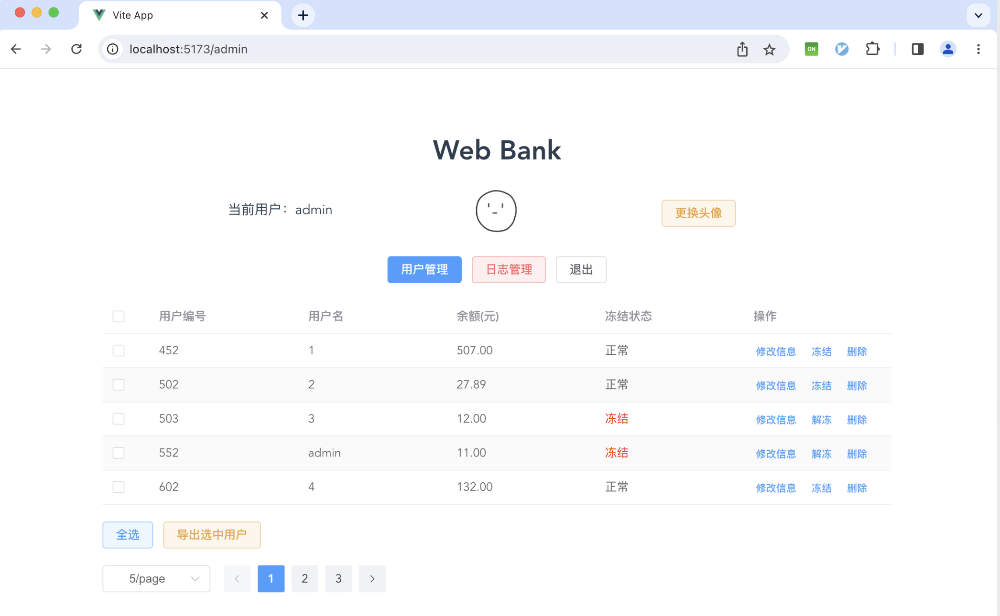
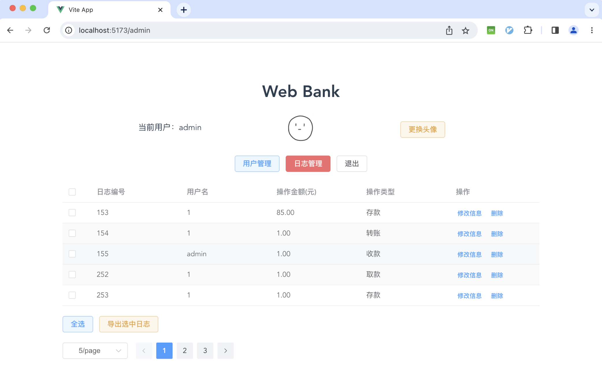
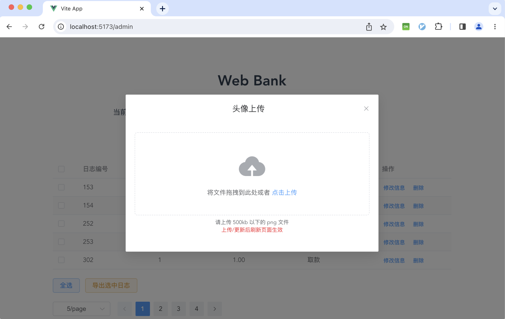
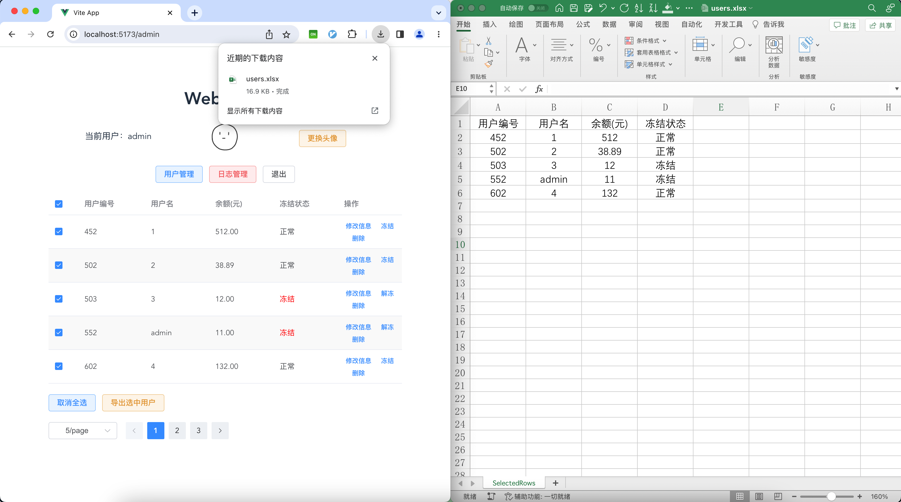
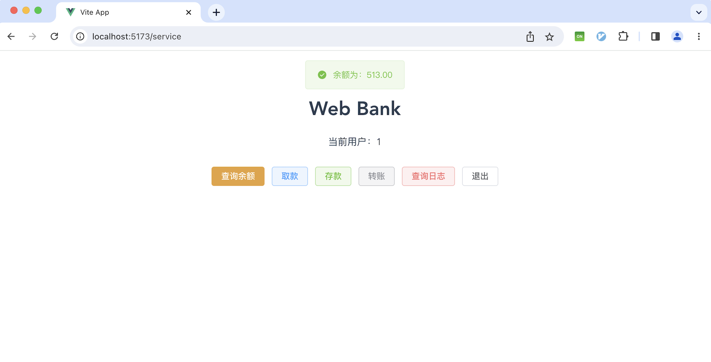
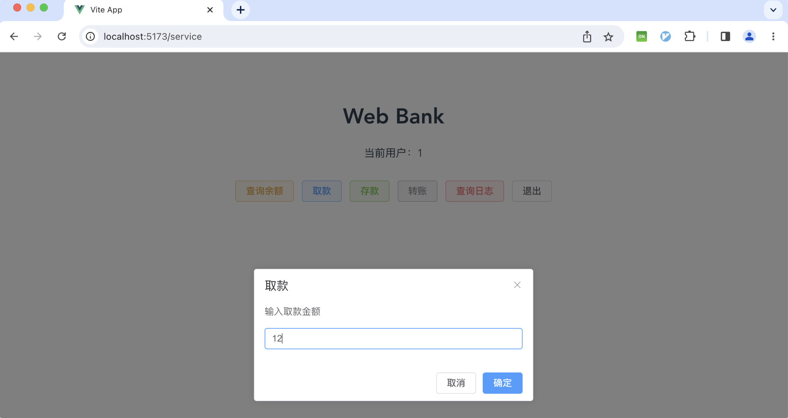
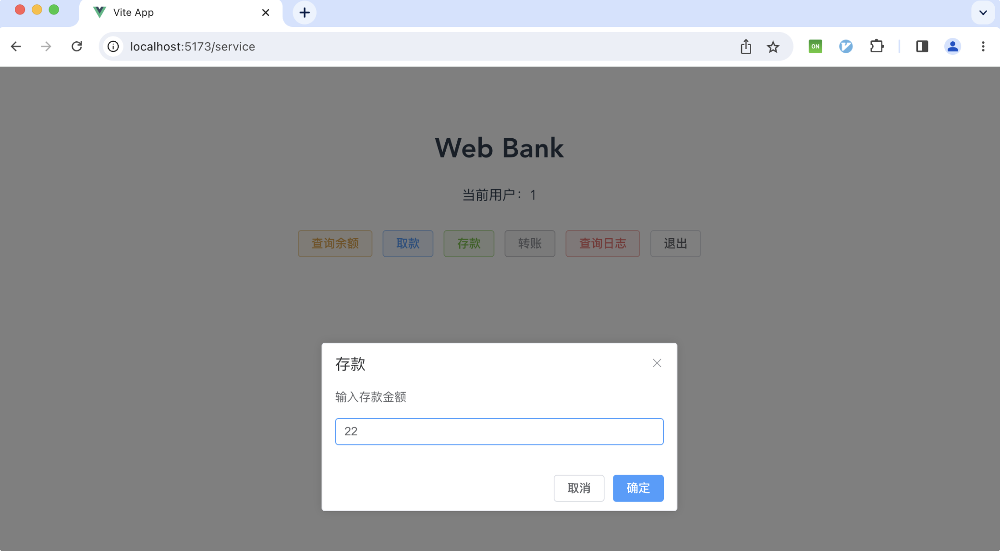
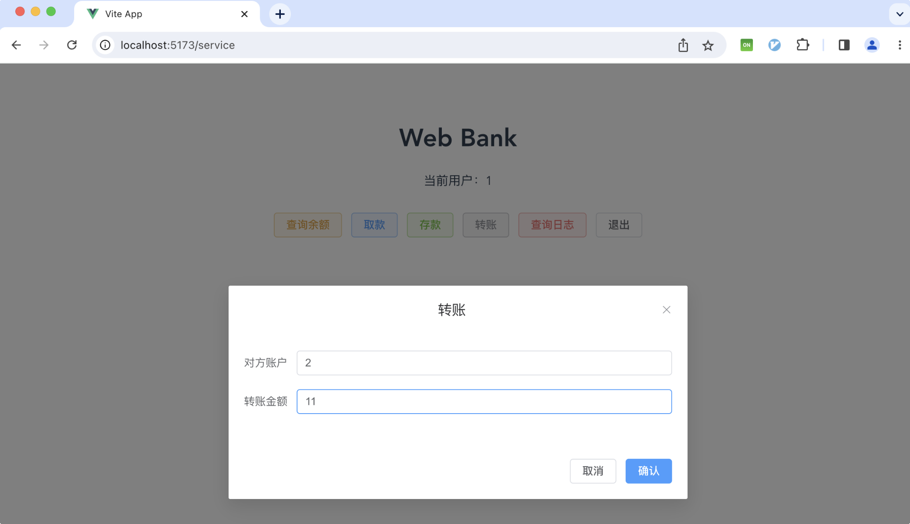
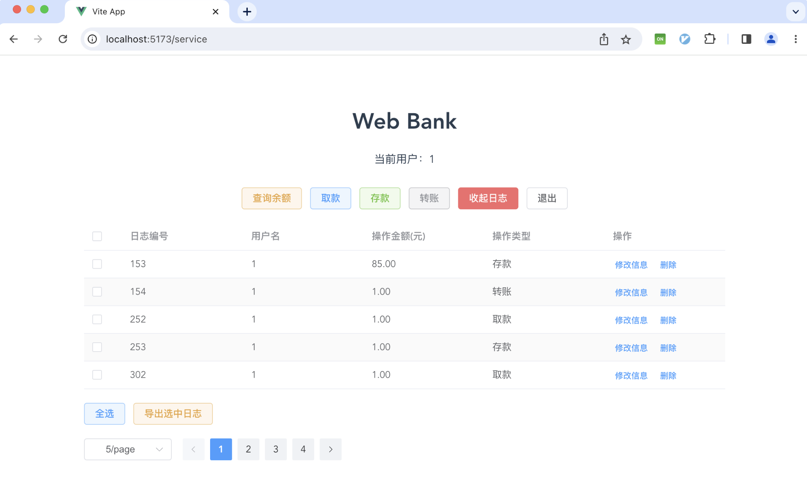

# bank

Java 模拟银行系统

# 技术选型
1. 后端：Spring Boot + Spring Data JPA + MySQL + Redis

2. [前端：Vue3 + Element Plus](https://github.com/prgding/bank-web-vue3)

# 功能列表
1. 管理员：
    - 用户管理：分页查询、修改用户、删除用户、冻结/解冻
    - 日志管理：分页查询、修改日志、删除日志
    - 头像上传
    - 用户、日志导出到 Excel
2. 普通用户
    - 注册、登录、验证码、JWT
    - 查询余额、存款、取款、转账、查看日志
# 运行截图

1. 注册、登录界面

2. 管理员 - 用户管理界面

3. 管理员 - 日志管理界面

4. 头像上传

5. 数据导出到 Excel

5. 普通用户功能界面

6. 取款

7. 存款

8. 转账

9. 查看个人明细

